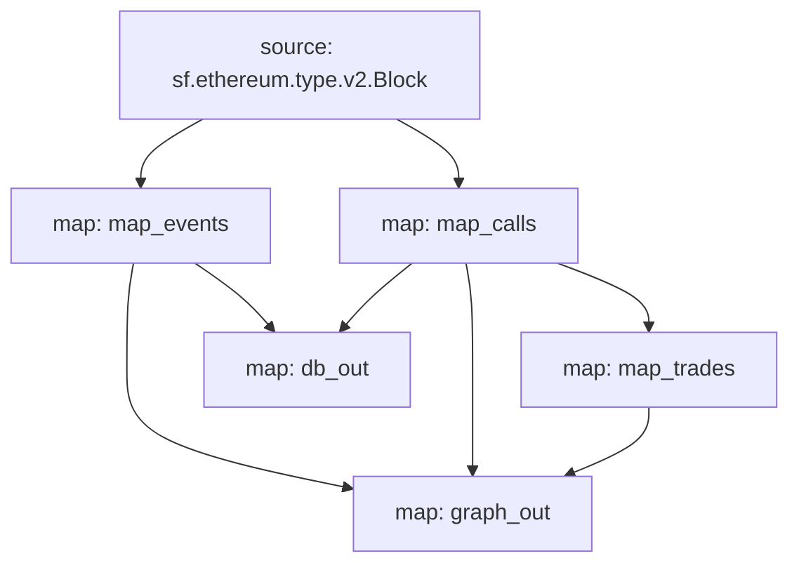

# Blur Exchange (V2) Substreams powered Subgraph

This substream indexes trades and operations made on the Blur NFT Exchange (https://blur.io/). All raw events and calls are mapped first, then adapted to a single trade entity.

::: warning Note: Only four types of trades are supported for now: TakeAsk, TakeAskSingle, TakeBid, TakeBidSingle. :::

## Quick Start

```bash
make protogen & make build
substreams run -e mainnet.eth.streamingfast.io:443 substreams.yaml graph_out --start-block 17628986 --stop-block +1
```

## GraphQL Entities

```graphql
type trades @entity {
    id: ID!
    tx_hash: String!
    block_time: String!
    eth_value: BigInt!
    trade_type: String!
    erc_721_transfers: [erc_721_transfers!]
}

type erc_721_transfers @entity {
    id: ID!
    tx_hash: String!
    from: String!
    to: String!
    token_id: BigInt!
    amount: Int!
    collection: String!
    asset_type: String!
}

enum AssetType {
    ERC721
    ERC1155
}

enum TradeType {
    TakeAsk
    TakeAskSingle
    TakeAskSinglePool
    TakeBid
    TakeBidSingle
    TakeBidSinglePool
}
...
```


## Modules



```yaml
Package name: blurexchange_v2
Version: v0.1.0
Modules:
----
Name: map_events
Initial block: 17603892
Kind: map
Input: source: sf.ethereum.type.v2.Block
Output Type: proto:contract.v1.Events
Hash: 7c0444cc06f431b7248bf301d1c41fe049d894ee

Name: map_calls
Initial block: 17603892
Kind: map
Input: source: sf.ethereum.type.v2.Block
Output Type: proto:custom.v1.CallsWithInputs
Hash: e9ca2287ebe5c4307eda1ee99c8c6b4456c1258e

Name: map_trades
Initial block: 17603892
Kind: map
Input: map: map_calls
Output Type: proto:custom.v1.Trades
Hash: 5f8b275f04fdb3ab56e4823d5e31f0593e8a60f0

Name: db_out
Initial block: 17603892
Kind: map
Input: map: map_events
Input: map: map_calls
Output Type: proto:sf.substreams.sink.database.v1.DatabaseChanges
Hash: 2a5acdd9790fb4c3d46985baad500f953c17bd28

Name: graph_out
Initial block: 17603892
Kind: map
Input: map: map_events
Input: map: map_calls
Input: map: map_trades
Output Type: proto:sf.substreams.entity.v1.EntityChanges
Hash: 3110162e68904c523ed059eb79b149dfdf09bb80

Network: mainnet
```